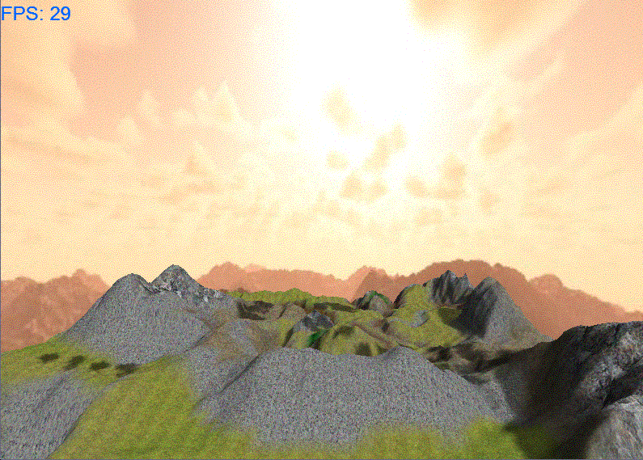



## Blank Engine 1\.0 Beta

### Description

Blank Engine is an open-source + 3d Game Engine. It will allow you to take your first step in creating a game. Blank Engine will supply a complete listing of many commonly use game features.
 
### More Info
 
I assume that you either know, or are willing to learn how to create a game, and the basics behind creating a game. I will always be able to help someone who is interested in learning how to make a game. I also assume that you have a basic to intermediate knowledge of VB6, again you can always learn how to program with VB6.

If you do not have a video card that supports DirectX 8.1 then you should probably get one before trying to use Blank Engine.

             |
---                |---
**Submitted On**   |2007-05-27 22:12:46
**By**             |[Peter W\.](https://github.com/Planet-Source-Code/PSCIndex/blob/master/ByAuthor/peter-w.md)
**Level**          |Intermediate
**User Rating**    |3.7 (11 globes from 3 users)
**Compatibility**  |VB 6\.0
**Category**       |[DirectX](https://github.com/Planet-Source-Code/PSCIndex/blob/master/ByCategory/directx__1-44.md)
**World**          |[Visual Basic](https://github.com/Planet-Source-Code/PSCIndex/blob/master/ByWorld/visual-basic.md)
**Archive File**   |[Blank\_Engi2067755272007\.zip](https://github.com/Planet-Source-Code/peter-w-blank-engine-1-0-beta__1-68663/archive/master.zip)

